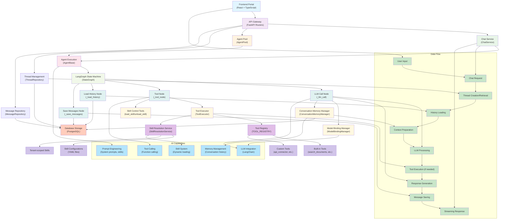

# LingQing Agent Architecture

## Overview

This document describes the detailed architecture of the LingQing agent system, including main components, inter-connections, built-in AI capabilities, and data flows.

## Architecture Diagram



## Main Components

### 1. Frontend Portal

- **Technology**: React + TypeScript
- **Purpose**: User interface for interacting with agents
- **Features**: Chat interface, thread management, agent configuration

### 2. API Gateway

- **Technology**: FastAPI Routers
- **Purpose**: HTTP request handling and routing
- **Endpoints**: Chat, threads, agents, tools, skills

### 3. Core Services

- **Chat Service** (`ChatService`): Orchestrates chat operations
- **Agent Pool** (`AgentPool`): Manages agent instances
- **Thread Management** (`ThreadRepository`): Handles conversation threads
- **Message Repository** (`MessageRepository`): Persists conversation messages

### 4. Agent Execution Engine

- **Agent Base** (`AgentBase`): Core agent implementation
- **LangGraph State Machine** (`StateGraph`): Manages agent state transitions
- **Nodes**:
  - LLM Call Node: Processes language model requests
  - Tool Node: Executes tool calls
  - Load History Node: Retrieves conversation history
  - Save Messages Node: Persists messages

### 5. LLM Integration Layer

- **Model Binding Manager** (`ModelBindingManager`): Manages LLM model connections
- **Conversation Memory Manager** (`ConversationMemoryManager`): Handles conversation context

### 6. Tool System

- **Tool Executor** (`ToolExecutor`): Executes tool calls
- **Skill Control Tools**: Dynamic skill loading/unloading
- **Tool Registry** (`TOOL_REGISTRY`): Central registry of available tools
- **Skill Resolution Service** (`SkillResolutionService`): Resolves skill configurations

### 7. Storage Layer

- **Database**: PostgreSQL for persistent storage
- **Tables**: Threads, messages, tenants, users, agents

## AI Capabilities Built-in

### 1. LLM Integration

- **Framework**: LangChain
- **Features**: Model-agnostic LLM calls, streaming responses
- **Models**: Support for multiple LLM providers

### 2. Prompt Engineering

- **System Prompts**: Dynamic prompt generation
- **Skill Injection**: Runtime skill loading into prompts
- **Context Management**: Multi-layer context assembly

### 3. Tool Calling

- **Function Calling**: Native LLM function calling support
- **Tool Registry**: Centralized tool management
- **Execution Safety**: Rate limiting, error handling

### 4. Memory Management

- **Conversation History**: Full message persistence
- **Summarization**: Automatic conversation summarization
- **Context Window**: Intelligent context management

### 5. Skill System

- **Dynamic Loading**: Runtime skill activation
- **YAML Configuration**: Declarative skill definitions
- **Tenant Scoping**: Tenant-specific skill availability

## Data Flows

### 1. User Input Flow

```
User Input → Chat Request → Thread Creation/Retrieval → History Loading
```

### 2. Context Preparation Flow

```
History Loading → Context Preparation → LLM Processing
```

### 3. Processing Flow

```
LLM Processing → Tool Execution (if needed) → Response Generation
```

### 4. Persistence Flow

```
Response Generation → Message Saving → Streaming Response
```

### 5. Complete Cycle

```
User Input → Chat Request → Thread Management → History Loading →
Context Preparation → LLM Processing → Tool Execution →
Response Generation → Message Saving → Streaming Response → User Output
```

## Key Design Principles

### 1. Clean Architecture

- **Layer Separation**: API → Service → Domain → Infrastructure
- **Dependency Direction**: Inward dependency only
- **No Circular Imports**: Strict module boundaries

### 2. Tenant Isolation

- **Multi-tenancy**: All operations scoped by tenant ID
- **Data Separation**: Tenant-specific data isolation
- **Permission Controls**: Role-based access control

### 3. Scalability

- **Stateless Services**: Horizontal scaling capability
- **Async Operations**: Non-blocking I/O throughout
- **Connection Pooling**: Efficient database connections

### 4. Observability

- **Structured Logging**: Consistent log format
- **Metrics Collection**: Performance monitoring
- **Error Tracking**: Comprehensive error handling

## Technology Stack

### Backend

- **Framework**: FastAPI (Python)
- **Async Runtime**: asyncio
- **Database**: PostgreSQL with SQLAlchemy
- **LLM Framework**: LangChain
- **Agent Framework**: LangGraph
- **Package Manager**: uv

### Frontend

- **Framework**: React + TypeScript
- **UI Library**: shadcn/ui
- **State Management**: React Query
- **Routing**: React Router
- **Styling**: Tailwind CSS

### Infrastructure

- **Containerization**: Docker
- **Orchestration**: Kubernetes (Helm charts)
- **CI/CD**: GitHub Actions
- **Monitoring**: Structured logging

## Security Considerations

### 1. Authentication & Authorization

- **JWT Tokens**: Secure authentication
- **RBAC**: Role-based access control
- **Tenant Scoping**: Automatic tenant isolation

### 2. Data Protection

- **Encryption**: Sensitive data encryption at rest
- **Input Validation**: Comprehensive input sanitization
- **Rate Limiting**: API rate limiting per tenant

### 3. Tool Security

- **Sandboxing**: Code execution in isolated environments
- **Permission Checks**: Tool-level permission validation
- **Audit Logging**: Complete action auditing

_HALO_
